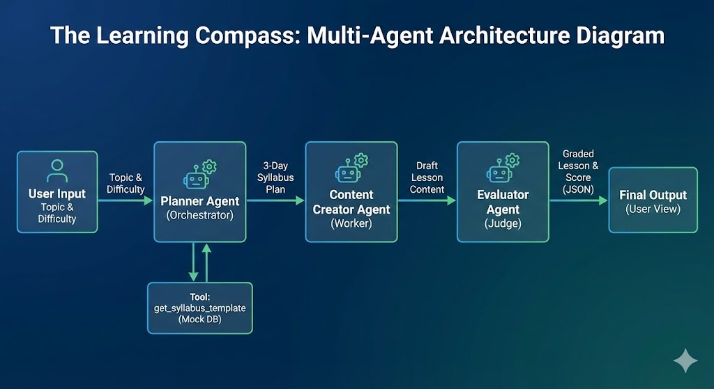

# 🧭 The Learning Compass: AI-Powered Curriculum Generator


**A robust multi-agent system that plans, drafts, critiques, and publishes personalized educational content.**

## 📋 Project Overview
The Learning Compass is not just a chatbot; it is an **agentic pipeline** designed to democratize education. It orchestrates a team of three specialized AI agents to generate high-quality, structured learning materials for any topic and difficulty level.

Unlike standard LLM interactions, this system implements **"LLM-as-a-Judge"** architecture with a **Self-Correction Loop**, ensuring that content is verified for quality before being delivered to the user as a tangible PDF artifact.

## ✨ Key Features
* **🤖 Multi-Agent Orchestration:** Sequential chain of specialized agents (Planner → Creator → Evaluator).
* **🛠️ Custom Tool Use:**
    * `get_syllabus_template`: Enforces pedagogical structure.
    * `save_lesson_to_pdf`: Generates downloadable PDF course files.
* **🔄 Self-Correction Loop:** If the Evaluator Agent rejects the content (Score < 4/5), the system automatically routes feedback to the Creator for a rewrite—no human intervention required.
* **⚖️ Structured Evaluation:** The Evaluator outputs strictly typed JSON metrics (`score`, `status`, `reasoning`) for programmatic parsing.

## 🧩 Architecture Diagram


## 🛠️ Technical Stack
* **Framework:** Google Agent Development Kit (`google-adk`)
* **Model:** Gemini 2.5 Flash Lite
* **PDF Generation:** fpdf library
* **Environment:** Python 3.11+ (Compatible with Kaggle/Colab & Local)
* **Concepts Applied:** Tool Use, Multi-Agent Orchestration, LLM-as-a-Judge, Robust Error Handling.

## 🚀 How to Run
1.  Clone the repository:
    ```bash
    git clone https://github.com/abhictrl/learning-compass-agent.git
    ```
2.  Install dependencies:
    ```bash
    pip install -r requirements.txt
    ```
3.  Set up your API Key:
    * Get a key from [Google AI Studio](https://aistudio.google.com/).
    * Set it in your environment variables as `GOOGLE_API_KEY`.
4.  Run the notebook in `notebooks/learning_compass_agent.ipynb`.

## 📸 Example Output

🏁 Starting Learning Compass for: Data Structures (Intermediate)

--- 🤖 PLANNER AGENT WORKING ---
User > Create a syllabus for 'Data Structures' at Intermediate level.
PlannerAgent > [Generates 3-Day structure covering Trees, Graphs, and Heaps]

--- 🤖 CONTENT AGENT WORKING ---
User > Write the 'Day 1' lesson for this syllabus.
ContentAgent > [Drafts detailed tutorial on Binary Search Trees with Python code]

--- 🤖 EVALUATOR AGENT WORKING ---
User > Evaluate this lesson content.
EvaluatorAgent > 
{
  "score": 4,
  "reasoning": "The lesson provides a solid introduction to BSTs with clear code examples. Coverage of time complexity is accurate.",
  "status": "PASS"
}

✅ Quality Check Passed!

--- 💾 SAVING PDF ARTIFACT ---
System: Successfully generated PDF: Data_Structures_Lesson.pdf


## 🔮 Future Improvements
* **RAG Integration:** Connect the Planner to a Vector Database of university textbooks.
* **Frontend:** Build a Streamlit UI to move beyond the CLI/Notebook interface.
* **Multi-Modal:** Allow the Content Agent to generate diagrams/images for the PDF.

## 📄 License
This project is licensed under the MIT License - see the [LICENSE](LICENSE) file for details.